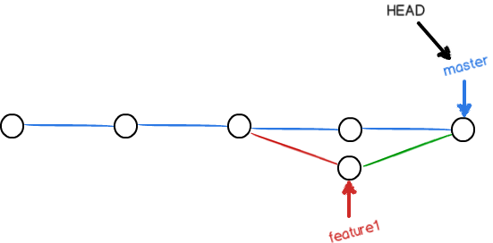
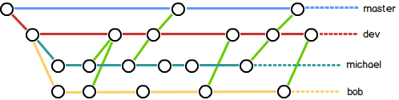

# Git教程笔记

- 学习参考网站：https://www.liaoxuefeng.com/wiki/896043488029600
- 关键命令的记录和注释
- 记录git基本原理和图表注解

## [创建版本库](https://www.liaoxuefeng.com/wiki/896043488029600/896827951938304)

    git init    # 创建仓库  
    git add readmetxt   # 添加readme.txt到仓库  
    git commit -m "wrote readme file"   # 文件提交到仓库，"-m"后面输入的是本次提交的说明  

## 时光机穿梭

### [版本回退](https://www.liaoxuefeng.com/wiki/896043488029600/897013573512192)

    git log # 查看提交历史，commit id（版本号）
    git log --pretty=oneline    # 单行显示提交历史信息  
    git reset --hard HEAD^      # 回退到上一个版本（上一个版本：HEAD^，上上一个版本：HEAD^^，往上100个版本：HEAD~100） 
    git reset --hard 1094a      # 向后恢复到指定版本  
    git reflog                  # 查看回溯命令历史（移动Head指针） 

### [工作区和暂存区](https://www.liaoxuefeng.com/wiki/896043488029600/897271968352576#0)

工作区（含有.git的当前目录）->stage（暂存区）->master（分支）

    git status  # 查看状态
    git add .   # 添加所有未更新文件
    git commit -m "understand how stage works"
    git status  # 工作区是否“干净”

### [管理修改](https://www.liaoxuefeng.com/wiki/896043488029600/897884457270432)

    cat readme.txt  # 捉取readme.txt内容
    git diff HEAD -- readme.txt # 查看工作区和版本库里面最新版本的区别

注意事项：第一次修改 -> git add -> 第二次修改 -> git add -> git commit，防止第二次修改未提交

### [撤销修改](https://www.liaoxuefeng.com/wiki/896043488029600/897889638509536)

    # 场景1：仍在工作区
    git checkout -- file    # 撤销工作区的修改
    # 场景2：已提交到暂存区
    git add file
    git reset HEAD <file>   # 撤销暂存区的修改（unstage）
    git checkout -- file    # 撤销工作区修改
    # 场景3：提交到版本库但未推送到远程库
    # 参考“版本回退”小节

注意事项：
1. 命令git checkout -- readme.txt会将readme.txt文件在工作区的修改全部撤销，此处分两种情况：(a) readme.txt自修改后还没有被放到暂存区，现在，撤销修改就回到和版本库一模一样的状态；(b) readme.txt已经添加到暂存区后，又作了修改，若撤销修改就回到添加到暂存区后的状态，即让这个文件回到最近一次git commit或git add时的状态
2. git checkout -- file命令中的--很重要，没有--，就变成了“切换到另一个分支”的命令

### [删除文件](https://www.liaoxuefeng.com/wiki/896043488029600/900002180232448#0)

    git add test.txt
    git commit -m "add test.txt"
    rm test.txt # 使用rm命令删除文件
    git status  # 得知那些文件被删除
    git rm test.txt # 从版本库中删除test.txt文件
    # git add test.txt  # 与上述执行效果一致
    git commit -m "remove test.txt"
    # 若删除错误，可从版本库中恢复误删文件
    git checkout -- test.txt

## [远程仓库](https://www.liaoxuefeng.com/wiki/896043488029600/896954117292416)

- 本地Git仓库<->GitHub<->第三方
- 本地Git仓库和GitHub仓库由SSH加密传输

        ssh-keygen -t rsa -C "youremail@example.com"  
        ...一直回车

-  SSH Key密钥对：id_rsa（私钥，不可泄露）和id_rsa.pub（公钥）
-  GitHub->“Account settings”->“SSH Keys”->“Add SSH Key”->填上任意Title->Key文本框里粘贴id_rsa.pub文件的内容
-  原文更正：[GitHub 重磅更新：无限私有仓库免费使用](https://www.infoq.cn/article/aKm94Aw1RmDL_9Gysm8D)

### [添加远程库](https://www.liaoxuefeng.com/wiki/896043488029600/898732864121440#0)

    git remote add origin https://github.com/fengyihuai/learngit.git    # 关联本地库到远程库，推荐https链接方式
    git push -u origin master    # 把本地库的所有内容推送到远程库
    git push origin master       # 本地master分支的最新修改推送至GitHub

注意事项：
1. 第一次推送master分支时，若加上了-u参数，Git在将本地的master分支内容推送的远程新的master分支同时，额外关联本地的master分支和远程的master，在后续的推送或者拉取中就可以简化命令，master分支为默认推送目标
2. SSH警告 当你第一次使用Git的clone或者push命令连接GitHub时，会得到一个警告：
  
> The authenticity of host 'github.com (xx.xx.xx.xx)' can't be established.  
> RSA key fingerprint is xx.xx.xx.xx.xx.  
> Are you sure you want to continue connecting (yes/no)?  

详细处理请访问本标题网页

### [从远程库克隆](https://www.liaoxuefeng.com/wiki/896043488029600/898732792973664)

    git clone https://github.com/michaelliao/gitskills.git  # 克隆远程库到本地
    # git clone git@github.com:michaelliao/gitskills.git    # 此法不推荐

注意事项：Git支持多种协议，包括https，但通过ssh支持的原生git协议速度最快（实测速度慢，且后期pull和push容易出现各种问题）

## [分支管理](https://www.liaoxuefeng.com/wiki/896043488029600/896954848507552)

假设你准备开发一个新功能，但是需要两周才能完成，第一周你写了50%的代码->创建了一个属于你自己的分支->继续提交，直到开发完毕后->一次性合并到原来的分支上，既安全，又不影响别人工作

### [创建于合并分支](https://www.liaoxuefeng.com/wiki/896043488029600/900003767775424)

    git checkout -b dev # 创建并切换到dev分支
    # -b参数表示创建并切换，相当于以下两条命令：
    # git branch dev
    # git checkout dev
    git branch  # 查看并列出所有分支
    # readme.txt修改：最后加上Creating a new branch is quick.
    git add readme.txt 
    git commit -m "branch test"
    git checkout master # 切换回master分支
    git merge dev   # 合并dev分支到master分支，Fast-forward：快进模式
    git branch -d dev   # 删除dev分支
    git branch  # 查看分支

### [解决冲突](https://www.liaoxuefeng.com/wiki/896043488029600/900004111093344)

修复冲突

    git checkout -b feature1    # 创建并切换到feature1分支
    git add readme.txt
    git commit -m "AND simple"
    git checkout master # 切换到master分支
    # 在master分支上把readme.txt文件的最后一行改为：Creating a new branch is quick & simple.
    git add readme.txt 
    git commit -m "& simple"
    git merge feature1  
    # 存在冲突，合并分支失败
    git status  # 查看冲突内容
    # 查看readme.txt，修改如下后保存：Creating a new branch is quick and simple.
    git add readme.txt 
    git commit -m "conflict fixed"
    git log --graph --pretty=oneline --abbrev-commit    # 查看分支合并情况
    git branch -d feature1  # 删除feature1分支

注意事项：用git log --graph命令可以看到分支合并图

### [分支管理策略](https://www.liaoxuefeng.com/wiki/896043488029600/900005860592480)

- Fast forward模式合并分支，删除分支后会丢掉分支信息。
- 若强制禁用Fast forward模式，Git将会在merge时生成一个新的commit，从而在分支历史上查找到分支信息
- -no-ff方式的git merge，普通模式合并，合并后的历史有分支

分支策略：master分支稳定，dev分支不稳定->各成员在dev分支进行工作->最终新版本发布到master分支  

        git checkout -b dev
        # 修改readme.txt文件
        git add readme.txt 
        git commit -m "add merge"
        git checkout master
        git merge --no-ff -m "merge with no-ff" dev # 合并dev分支，--no-ff：禁用Fast forward，-m参数：commit描述
        git log --graph --pretty=oneline --abbrev-commit    # 查看分支历史
        
### [bug分支](https://www.liaoxuefeng.com/wiki/896043488029600/900388704535136)

    git stash   # 存储当前工作空间
    # 假定需要在master分支上修复
    git checkout master
    git checkout -b issue-101
    # readme.txt：把“Git is free software ...”改为“Git is a free software ...”，修复bug
    git add readme.txt 
    git commit -m "fix bug 101"
    git checkout master
    git merge --no-ff -m "merged bug fix 101" issue-101
    # 切换回dev分支继续工作
    git checkout dev
    git status
    git stash list  # 查看存储的工作现场
    git stash pop   # 恢复并同时删除stash内容
    # git stash apply   # 恢复stash内容
    # git stash drop    # 删除stash内容

