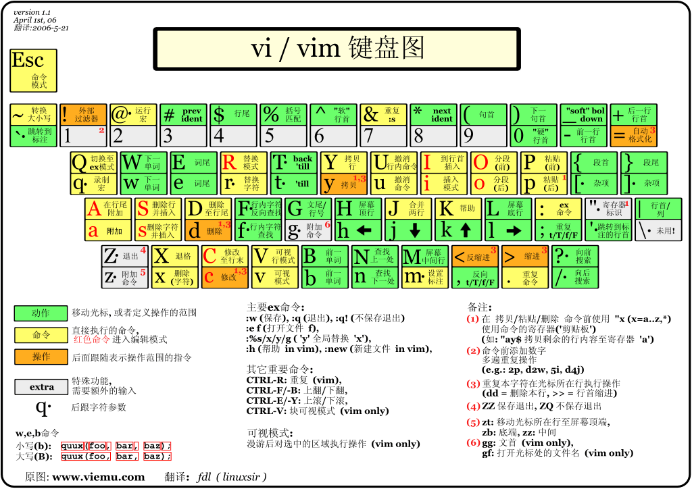

# Vim入门基础

参考：https://www.jianshu.com/p/bcbe916f97e1

- 本篇仅为笔记内容，版权归上述链接原作者所有
- 未成功运行命令被注释
- vim 键盘图：

## 简介

    vim [filename]  # 建立、修改文本文件

## 编辑模式

- 在被编辑的文件中移动光标的位置
- 进行剪切和粘贴正文块，删除正文和插入新的正文
- ESC可由插入模式退出到编辑模式
- 保存编辑器结果，退出编辑程序回到终端，`ZZ`命令

1. 跳转
   - 按字符移动：

            k               上移
            j               下移
            h               左移
            l               右移

   - 按页移动
        
            ctrl+f      在文件中前移一页（相当于 page down）
            ctrl+b      在文件中后移一页（相当于 page up）

   - 大范围的移动

            *         当光标停留在一个单词上，* 键会在文件内搜索该单词，并跳转到下一处
            #         当光标停留在一个单词上，# 在文件内搜索该单词，并跳转到上一处
            # (/)     移动到 前/后 句 的开始
            # {/}     跳转到 当前/下一个 段落 的开始
            g_      到本行最后一个不是 blank 字符的位置
            # fa      到下一个为 a 的字符处，你也可以fs到下一个为s的字符
            # t,      到逗号前的第一个字符。逗号可以变成其它字符
            # 3fa        在当前行查找第三个出现的 a
            F# /T        和 f 和 t 一样，只不过是相反方向
            gg       将光标定位到文件第一行起始位置
            G         将光标定位到文件最后一行起始位置
            NG或Ngg  将光标定位到第 N 行的起始位置

    - 当前页快速移动光标
    
            H               将光标移到屏幕上的起始行（或最上行）
            M               将光标移到屏幕中间
            L               将光标移到屏幕最后一行
        注意：H 和 L 命令还可以加数字，如 2H 表示将光标移到屏幕的第２行，3L 表示将光标移到屏幕的倒数第3行

    - 行内移动

            w               右移光标到下一个字的开头
            e               右移光标到一个字的末尾  # git bash下的vim存在bug，不能到单词的末尾
            b               左移光标到前一个字的开头
            0               数字０，左移光标到本行的开始
            $               右移光标，到本行的末尾
            ^               移动光标，到本行的第一个非空字符

2. 搜索匹配

    - 搜索方法是：键入字符 / ，后面跟以要搜索的字符串，然后按回车键

    - 编辑程序执行正向搜索（即朝文件末尾方向），并在找到指定字符串后，将光标停到该字符串的开头
    - 键入 n 命令可以继续执行搜索，找出这一字符串下次出现的位置
    - 用字符 ? 取代 / ，可以实现反向搜索（朝文件开头方向）

            /str1               正向搜索字符串 str1
            n                   继续搜索，找出 str1 字符串下次出现的位置
            N                   继续搜索，找出 str1 字符串上一次出现的位置
            ?str2               反向搜索字符串 str2 

    注意：搜索匹配最强大的地方是结合 正则表达式 来搜索

3. 替换和删除

    - Vim常规的删除命令是 `d`、 `x` (前者删除 行 ，后者删除 字符 )
    - 将光标定位于文件内指定位置后，可以用其他字符来替换光标所指向的字符，或从当前光标位置删除一个或多个字符或一行、多行

            rc               用 c 替换光标所指向的当前字符；
            nrc             用 c 替换光标所指向的前 n 个字符；  # Git bash中为后n个字符
            5rA             用 A 替换光标所指向的前 5 个字符；
            x                 删除光标所指向的当前字符；
            nx               删除光标所指向的前 n 个字符；      # Git bash中为后n个字符
            3x               删除光标所指向的前 3 个字符；
            dw               删除光标右侧的字；
            ndw             删除光标右侧的 n 个字；
            3dw             删除光标右侧的 3 个字；
            db               删除光标左侧的字；
            ndb             删除光标左侧的 n 个字；
            5db             删除光标左侧的 5 个字；
            dd               删除光标所在行，并去除空隙；
            ndd             删除（剪切） n 行内容，并去除空隙；
            3dd             删除（剪切） 3 行内容，并去除空隙；

    其他常用的删除命令有：

            d$              从当前光标起删除字符直到行的结束
            d0              从当前光标起删除字符直到行的开始
            J                删除本行的回车符（CR），并和下一行合并

    Vim常规的替换命令有 `c` 和 `s` ，结合Vim的其他特性可以实现基础的替换功能，不过替换命令执行以后，通常会由 **编辑模式** 进入 **插入模式** ：

            s               用输入的正文替换光标所指向的字符
            S               删除当前行，并进入插入模式
            ns               用输入的正文替换光标右侧 n 个字符
            nS             删除当前行在内的 n 行，并进入插入模式
            cw             用输入的正文替换光标右侧的字
            cW             用输入的正文替换从光标到行尾的所有字符（同 c$ )  # git bash中仅删除字，不同c$
            ncw           用输入的正文替换光标右侧的 n 个字
            cb             用输入的正文替换光标左侧的字
            ncb              用输入的正文替换光标左侧的 n 个字
            # cd               用输入的正文替换光标的所在行
            # ncd              用输入的正文替换光标下面的 n 行
            c$               用输入的正文替换从光标开始到本行末尾的所有字符
            c0               用输入的正文替换从本行开头到光标的所有字符

4. 复制粘贴

    正文中删除的内容（如字符、字或行）并没有真正丢失，而是被剪切并复制到了一个内存缓冲区中。

            p               小写字母 p，将缓冲区的内容粘贴到光标的后面
            P               大写字母 P，将缓冲区的内容粘贴到光标的前面

    注意：
    - 如果缓冲区的内容是字符或字，直接粘贴在光标的前面或后面
    - 如果缓冲区的内容为整行正文，执行上述粘贴命令将会粘贴在当前光标所在行的上一行或下一行
    - Vim 编辑器经常以一对大、小写字母（如 `p` 和 `P`）来提供一对相似的功能, 小写命令在光标的后面进行操作，大写命令在光标的前面进行操作

    把指定内容复制（而不是剪切）到内存缓冲区

            yy              复制当前行到内存缓冲区；
            nyy             复制 n 行内容到内存缓冲区；
            5yy             复制 5 行内容到内存缓冲区；
            “+y          复制 1 行到操作系统的粘贴板；  # git bash中卫"+yy
            “+nyy          复制 n 行到操作系统的粘贴板。
            
5. 撤销和重复
   
    - 消除某个错误的编辑命令造成的后果，可以用撤消命令
    - 需要在新的光标位置重复前面执行过的编辑命令，可用重复命令

## 插入模式

1. 进入插入模式
    
    以下命令可进入插入模式

        i           在光标左侧插入正文
        a            在光标右侧插入正文
        o            在光标所在行的下一行增添新行
        O           在光标所在行的上一行增添新行
        I            在光标所在行的开头插入
        A           在光标所在行的末尾插入

2. 退出插入模式

    按 `ESC` 键或组合键 `Ctrl+[` ，退出插入模式之后，将会进入编辑模式

## 命令模式

   - 在Vim的命令模式下，可以使用复杂的命令
   - 在编辑模式下键入 : ，光标就跳到屏幕最后一行，并在那里显示冒号，此时已进入命令模式
   - 命令模式又称 末行模式 ，用户输入的内容均显示在屏幕的最后一行，按回车键，Vim 执行命令

...... To be contiuned

## Vim配置

- Vim的配置是通常是存放在用户主目录的 .vimrc 的隐藏文件中的
- 基础配置：编程语言语法高亮、缩进设置、行号显示、搜索高亮、TAB键设置、字体设置、Vim主题设置等等
- 高级配置：编程语言缩进、自动补全设置等，具体配置项可以参考：[Vim Options](http://vimcdoc.sourceforge.net/doc/options.html#%27completeopt%27)或其它资料

## Vim插件

- 常用插件主要是目录（文件）查看和管理、编程语言缩进与自动补全、编程语言Docs支持、函数跳转、项目管理等等，简单配置可以参考：[Vim插件简单介绍](http://blog.segmentfault.com/xuelang/1190000000630547)  [手把手教你把Vim改装成一个IDE编程环境(图文)](http://blog.csdn.net/wooin/article/details/1858917)  [将Vim改造为强大的IDE](http://www.cnblogs.com/zhangsf/archive/2013/06/13/3134409.html)  

- Vim插件开发介绍可以参考：[Writing Vim Plugins](http://stevelosh.com/blog/2011/09/writing-vim-plugins/)

## Vim完整文档

  - Vim官方文档：http://vimdoc.sourceforge.net/
  - Vim中文用户手册7_3.pdf ：http://pan.baidu.com/s/1jGzbTBo